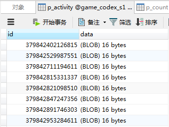
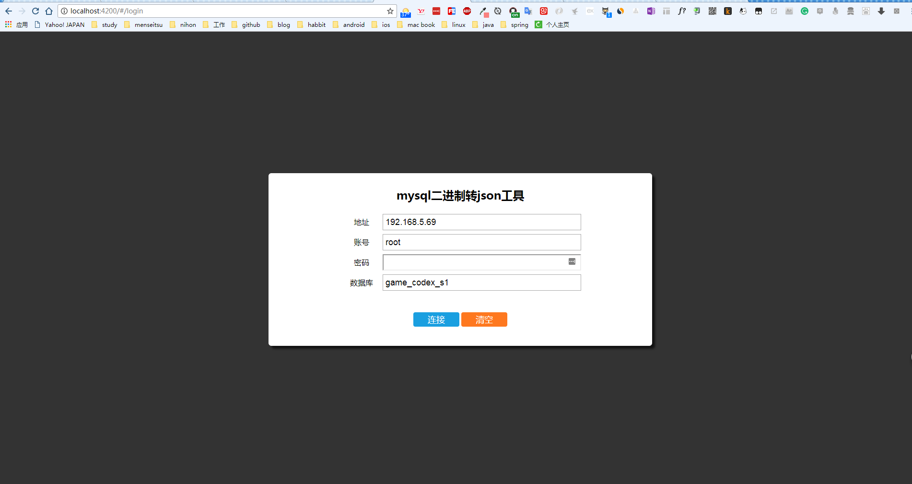
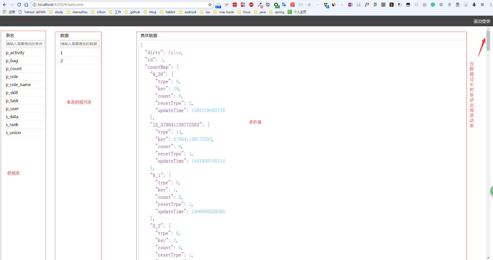
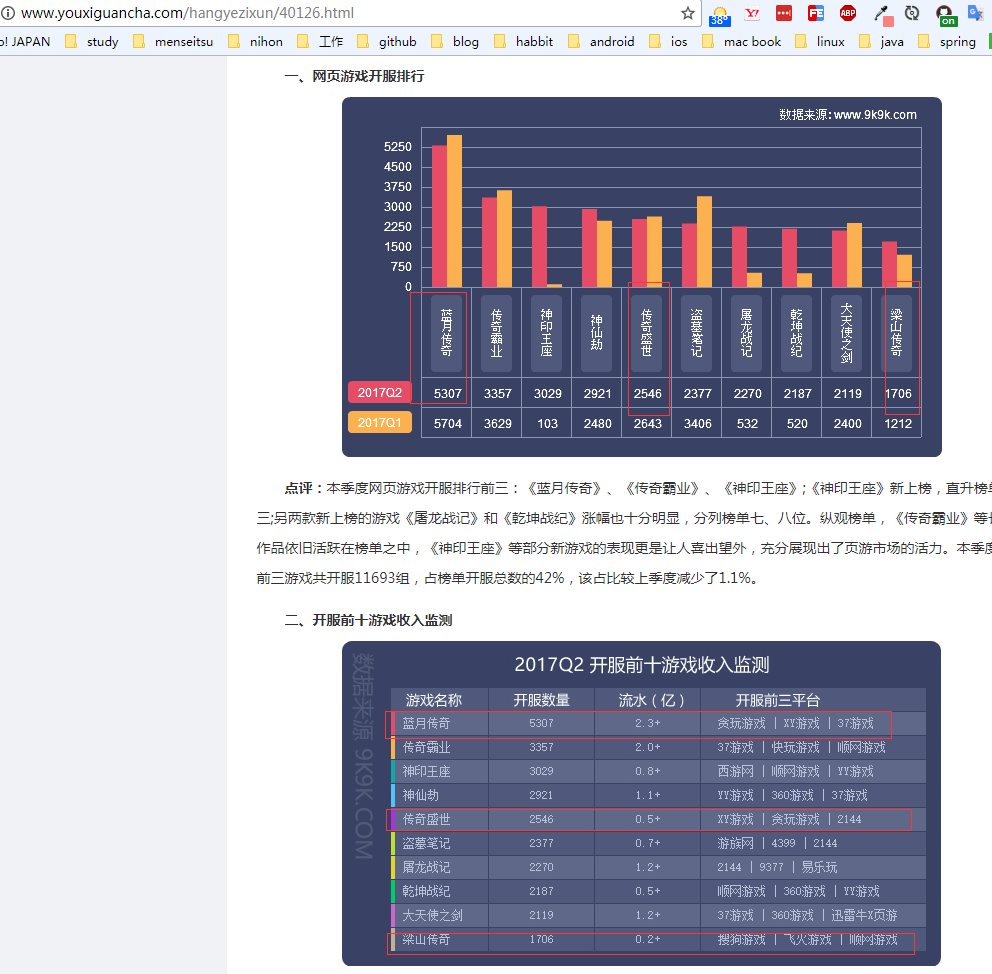

[](https://travis-ci.org/xiaomoinfo/MysqlBlobToJsonTool)
# 一 开发此工具的缘由
由于本人在游戏公司做java游戏服务端主程，使用的是mysql数据库，采用`protosbuf`序列化之后存入数据库，玩家上线的时候读取数据然后反序列化。
因此造成了一个问题，因为数据都是二进制的，mysql客户端不能直接查看具体数据,虽然也有java的工具 通过http连接到游戏服查看玩家数据。但是每次查询操作都十分浪费时间。
所以打算开发一款工具用来查看二进制数据，看起来算是一个简易版本的mysql客户端工具了。数据格式如下：    




# 二 使用的工具
服务端用java开发,前端用angular4开发。（小插曲：最初打算做跨平台的桌面版本，由于不熟悉javafx就换成了web版本，不过好处就是打开网页就用能，也比较方法）


# 三  screenshot






# 四 鸣谢
[@alice](https://github.com/AlicePrincess) 一个技术过硬的前端萌妹子，梦想进入google工作。擅长前端开发,能熟练使用react和angular框架开发，有多个线上项目开发经验。本工具前端由@alice花费半天时间完成。()
ORZ


# 五 注意事项
`protosbuf`的序列化和反序列化严重依赖于它的`@tag`，因此造成了本项目代码不能开箱即用，需要配合具体项目的实体类去反序列化，不然会出现乱码。如下所示：


```
            if (tableName.equals("p_role")) {
                Role role = template.queryData(tableName, Role.class, id);
                return new Result<>((T) role);
            } else if (tableName.equals("p_bag")) {
                RoleBag bag = template.queryData(tableName, RoleBag.class, id);
                return new Result<>((T) bag);
            } else if (tableName.equals("p_activity")) {
                RoleActivity user = template.queryData(tableName, RoleActivity.class, id);
                return new Result<>((T) user);
            } else if (tableName.equals("p_skill")) {
                RoleSkill skill = template.queryData(tableName, RoleSkill.class, id);
                return new Result<>((T) skill);
            } else if (tableName.equals("s_data")) {
                int dataId = Cast.toInteger(id);
                if (dataId == SysData.COUNT) {
                    GlobalCount globalCount = template.queryData(tableName, GlobalCount.class, id);
                    return new Result<>((T) globalCount);
                } else if (dataId == SysData.WORLD_STORAGE) {
                    WorldStorage worldStorage = template.queryData(tableName, WorldStorage.class, id);
                    return new Result<>((T) worldStorage);
                }
            } else if (tableName.equals("s_rank")) { /// FIXME: 2017/7/28  排行榜占位
                User user = template.queryData(tableName, User.class, id);
                return new Result<>((T) user);
            } else if (tableName.equals("s_union")) {
                Union union = template.queryData(tableName, Union.class, id);
                return new Result<>((T) union);
            } else if (tableName.equals("p_count")) {
                RoleCount count = template.queryData(tableName, RoleCount.class, id);
                return new Result<>((T) count);
            } else if (tableName.equals("p_task")) {
                RoleTask roleTask = template.queryData(tableName, RoleTask.class, id);
                return new Result<>((T) roleTask);
            } else if (tableName.equals("p_user")) {
                User user = template.queryUser(tableName, id);
                return new Result<>((T) user);
            }
```


# 六 招聘
>  1. 公司现面向所有游戏开发者招聘 `java`,`as3`,`egret`,`c++`,`cocos`,`unity`,`美术UI和原画`，`数值策划和系统策划`，`文案`，`法务`，`运营`，`客服`,`运维`等,有意向可找联系我内推。   
>  2. 公司己上线游戏页游《蓝月传奇》(月流水最高2.3亿),《传奇盛世》(月流水最高9000万),《梁山传奇》,《传奇世界》,《原始传奇》等         
>  3. 公司己上线手游《王者传奇》(最高月流水3亿,冲击4亿中)和多款3d和2d手游正在开发中。                   
>  4. 公司坐标 杭州滨江，单休，966(游戏公司常态)，有偿加班。       


# 七 公司产品信息
[2017Q2网页游戏数据报告](http://www.youxiguancha.com/hangyezixun/40126.html)


